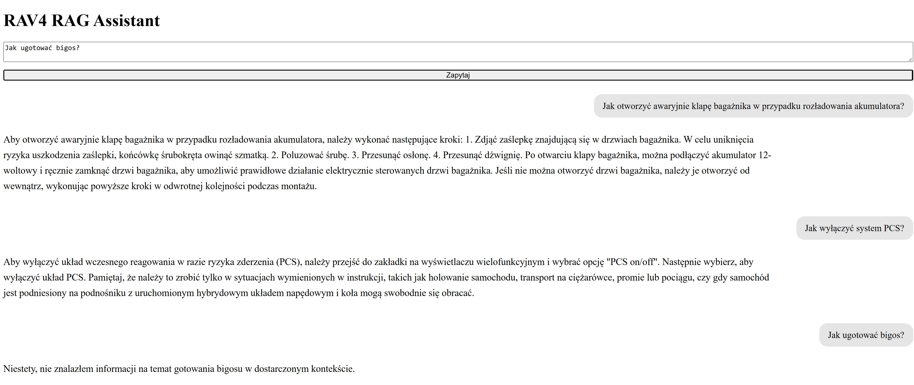

# RAV4 RAG Assistant

A Retrieval-Augmented Generation (RAG) assistant for answering technical questions based on the Toyota RAV4 owner's manual.

The project implements a complete RAG pipeline: PDF preprocessing, structure-aware chunking, semantic retrieval, cross-encoder reranking, LLM-based answer generation, a REST API and a simple web interface.

The assistant is designed to answer questions using information retrieved from the supplied vehicle documentation rather than relying on the language model's general knowledge.

---

## Demo



Example questions:

- How can the luggage compartment be opened when the 12V battery is discharged?
- How can the PCS system be disabled?
- What should I do if the gear selector cannot be operated?

The assistant is also instructed to reject questions that cannot be answered from the retrieved documentation.

For example, when asked:

> Jak ugotować bigos?

the assistant reports that this information was not found in the supplied context.

---

## Architecture

```text
Toyota RAV4 Owner's Manual (PDF)
              │
              ▼
        PDF extraction
              │
              ▼
      Text normalization
              │
              ▼
  Structure-aware chunking
              │
              ▼
 intfloat/multilingual-e5-base
           embeddings
              │
              ▼
          FAISS index
              │
              ▼
      Semantic retrieval
         Top 20 chunks
              │
              ▼
   BGE Reranker v2-m3
           Top 5
              │
              ▼
       Context + Question
              │
              ▼
        Bielik 11B LLM
              │
              ▼
           FastAPI
              │
              ▼
           Web UI
```

---

## Tech Stack

- Python 3.11
- PyPDF
- Hugging Face Transformers
- Sentence Transformers
- PyTorch
- `intfloat/multilingual-e5-base`
- FAISS
- `BAAI/bge-reranker-v2-m3`
- Ollama
- `SpeakLeash/bielik-11b-v2.3-instruct:Q8_0`
- FastAPI
- Uvicorn
- HTML
- CSS
- JavaScript

---

## How It Works

### 1. PDF processing

The owner's manual is extracted from PDF and normalized before further processing.

The preprocessing stage also handles document-specific artifacts, including repeated page footers and words split between lines.

The processed document is stored as structured JSON for the next stages of the pipeline.

### 2. Structure-aware chunking

Instead of splitting the entire document into arbitrary character ranges, the application detects sections of the manual and creates token-based chunks within those sections.

Current configuration:

```text
Chunk size: 300 tokens
Overlap:     50 tokens
Step:        250 tokens
```

The tokenizer from the embedding model is used during chunk creation, allowing chunk sizes to correspond directly to the representation used during retrieval.

### 3. Embeddings

Each document chunk is converted into a dense vector using:

```text
intfloat/multilingual-e5-base
```

The E5 retrieval convention is used:

```text
passage: <document chunk>
query: <user question>
```

Embeddings are normalized before being stored in the vector index.

### 4. Vector search

Document embeddings are stored in a FAISS `IndexFlatIP` index.

When the user submits a question, the question is embedded using the same E5 model and the system retrieves the 20 most semantically similar document chunks.

### 5. Reranking

Initial retrieval results are reranked using the cross-encoder:

```text
BAAI/bge-reranker-v2-m3
```

The reranker evaluates each retrieved document fragment together with the original question.

The five highest-ranked chunks are selected as context for the language model.

This creates a two-stage retrieval architecture:

```text
E5 + FAISS
    │
    │ fast semantic retrieval
    ▼
Top 20 candidates
    │
    │ more precise cross-encoder scoring
    ▼
BGE Reranker
    │
    ▼
Top 5 context chunks
```

### 6. Answer generation

The retrieved context and user question are sent to:

```text
SpeakLeash/bielik-11b-v2.3-instruct:Q8_0
```

through Ollama.

The system prompt instructs the model to:

- answer using the supplied context,
- avoid inventing missing procedures or settings,
- avoid filling gaps using its own knowledge,
- report when the required information cannot be found in the documentation.

### 7. API

FastAPI exposes the RAG pipeline through a REST endpoint:

```text
POST /ask
```

The application also provides:

```text
GET /health
```

for a basic health check.

### 8. Web interface

A lightweight HTML/CSS/JavaScript interface communicates directly with the FastAPI backend.

Questions and generated answers are displayed as a simple conversation.

---

## Project Structure

```text
rav4-rag-assistant/
│
├── data/
│   └── .gitkeep
│
├── src/
│   ├── rag/
│   │   ├── __init__.py
│   │   ├── retriever.py
│   │   ├── reranker.py
│   │   ├── generator.py
│   │   └── pipeline.py
│   │
│   ├── api.py
│   ├── load_pdf.py
│   ├── chunk_text.py
│   └── create_embeddings.py
│
├── static/
│   └── index.html
│
├── assets/
│   └── rav4-rag-demo.jpg
│
├── requirements.txt
├── .gitignore
└── README.md
```

---

## Source Document

The Toyota RAV4 owner's manual used during development is **not included in this repository**.

Toyota provides vehicle-specific owner's manuals through its official customer services. Access to the appropriate manual may require the vehicle's VIN.

The VIN used during development is private and is not included in this repository.

To run the project with your own Toyota documentation:

1. Obtain the appropriate owner's manual for your vehicle from Toyota.
2. Download the manual as a PDF.
3. Create the following directory inside the project:

```text
data/documents/
```

4. Place the PDF inside this directory.

The development version of the project expects:

```text
data/documents/PZ49X-42D12-PL.pdf
```

If your PDF uses a different filename, update:

```python
PDF_PATH = Path("data/documents/your-manual.pdf")
```

in:

```text
src/load_pdf.py
```

### Important

The Toyota PDF itself is intentionally excluded from Git and is **not redistributed with this project**.

Generated document data and the FAISS index are also excluded from the repository.

The current text-normalization rules were developed for the Polish Toyota RAV4 manual used during development. Manuals with different PDF encodings or structures may require adjustments to the preprocessing stage.

---

## Installation

### 1. Clone the repository

```bash
git clone https://github.com/Krzysztof-Broniszewski/rav4-rag-assistant.git
cd rav4-rag-assistant
```

### 2. Create a Python environment

Python 3.11 is recommended.

Using Mamba:

```bash
mamba create -n rag-project python=3.11
mamba activate rag-project
```

Conda can be used in the same way:

```bash
conda create -n rag-project python=3.11
conda activate rag-project
```

### 3. Install dependencies

```bash
pip install -r requirements.txt
```

A CUDA-enabled PyTorch installation can be used to accelerate embedding generation and model-based reranking.

The retrieval pipeline can also operate on CPU, although processing will be slower.

---

## Ollama and Bielik

The current version uses a locally running LLM through Ollama.

Install Ollama and make sure the Ollama service is running.

The model used during development is:

```text
SpeakLeash/bielik-11b-v2.3-instruct:Q8_0
```

Download it with:

```bash
ollama pull SpeakLeash/bielik-11b-v2.3-instruct:Q8_0
```

The model configuration can be changed in:

```text
src/rag/generator.py
```

Because the current version performs local LLM inference, sufficient RAM/VRAM and disk space are recommended.

---

## Building the RAG Index

The source PDF and generated data files are intentionally excluded from Git.

After placing the manual in:

```text
data/documents/
```

run the preprocessing pipeline from the project root.

### 1. Extract and normalize the PDF

```bash
python src/load_pdf.py
```

This creates:

```text
data/processed/rav4_manual.json
```

### 2. Create document chunks

```bash
python src/chunk_text.py
```

This creates:

```text
data/processed/rav4_chunks.json
```

### 3. Generate embeddings and build the FAISS index

```bash
python src/create_embeddings.py
```

This creates:

```text
data/processed/rav4_faiss.index
```

The preprocessing pipeline therefore looks like:

```text
PDF
 │
 ▼
rav4_manual.json
 │
 ▼
rav4_chunks.json
 │
 ▼
Embeddings
 │
 ▼
rav4_faiss.index
```

These generated files do not need to be committed to Git.

---

## Running the Application

Make sure:

1. the document has been processed,
2. the FAISS index has been created,
3. Ollama is running,
4. the Bielik model is available.

Then start FastAPI from the project root:

```bash
uvicorn src.api:app --reload
```

Open the web application:

```text
http://127.0.0.1:8000/
```

FastAPI interactive documentation is available at:

```text
http://127.0.0.1:8000/docs
```

Health endpoint:

```text
http://127.0.0.1:8000/health
```

---

## API Example

### Request

```http
POST /ask
Content-Type: application/json
```

```json
{
    "question": "Jak wyłączyć system PCS?"
}
```

### Response

```json
{
    "answer": "..."
}
```

---

## Example Questions

The following types of questions can be used to test the assistant:

```text
Jak wyłączyć system PCS?
```

```text
Jak odblokować lewarek zmiany biegów w razie awarii?
```

```text
Jak otworzyć awaryjnie klapę bagażnika w przypadku rozładowania akumulatora?
```

An unrelated question can be used to test whether the system remains grounded in the documentation:

```text
Jak ugotować bigos?
```

The assistant should report that the requested information was not found in the supplied documentation.

---

## Design Decisions

### Why E5?

`multilingual-e5-base` provides multilingual semantic embeddings and works well with Polish queries and documentation.

### Why FAISS?

FAISS provides a simple and efficient vector-search implementation and makes it possible to understand the retrieval layer without introducing an external vector database at the first stage of the project.

### Why a reranker?

Vector similarity is useful for quickly retrieving candidate chunks, but semantic similarity alone does not always provide the best final ordering.

The cross-encoder reranker evaluates the question and candidate text together, providing a second, more precise relevance stage.

### Why local Bielik?

Using Bielik through Ollama makes it possible to run the complete RAG pipeline locally without sending the vehicle documentation or questions to an external LLM provider.

The generation layer is kept separate from retrieval and reranking so that another LLM provider can be introduced in a future version.

---

## Current Limitations

This is the first portfolio version of the project.

Current limitations include:

- designed and tested primarily with one Polish Toyota RAV4 manual,
- document-specific PDF text normalization,
- local LLM inference through Ollama,
- no persistent conversational memory,
- no formal retrieval evaluation dataset yet,
- page-level source citations are not yet exposed in the web interface,
- some information stored in tables may require improved extraction or retrieval,
- running the complete application currently requires access to an appropriate source manual.

---

## Roadmap

Planned improvements include:

- automated RAG evaluation dataset,
- retrieval metrics such as Recall@K,
- improved document metadata,
- page-level source citations,
- multi-document support,
- configurable LLM providers,
- API-based LLM generation for public deployment,
- Qdrant vector database,
- Docker support,
- improved frontend,
- persistent conversation history,
- public live demo.

---

## Project Goals

This project was created as a practical implementation of a complete Retrieval-Augmented Generation system.

The goal was not only to use an existing RAG framework, but to implement and understand the individual stages of the pipeline:

- PDF extraction,
- text normalization,
- token-based chunking,
- embedding generation,
- vector indexing,
- semantic retrieval,
- cross-encoder reranking,
- context construction,
- grounded LLM generation,
- REST API integration,
- web interface.

The project demonstrates how individual NLP, information-retrieval and backend components can be combined into an end-to-end AI application.

---

## Disclaimer

This project is an independent educational and portfolio project.

Toyota documentation is not included in the repository. Toyota and RAV4 are trademarks of their respective owner.

The assistant should not be treated as a replacement for the official vehicle documentation, safety instructions or professional vehicle service.